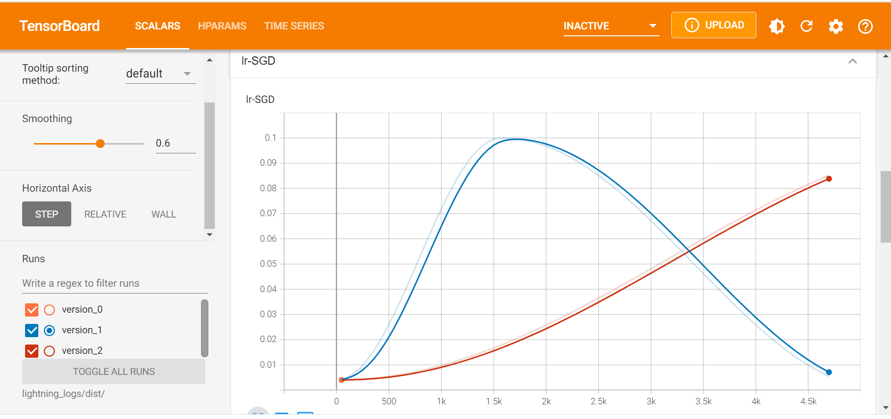

# BigDL-Nano PyTorch Trainer Quickstart

**In this guide we will describe how to scale out PyTorch programs using Nano Trainer in 5 simple steps**

### Step 0: Prepare Environment

We recommend using [conda](https://docs.conda.io/projects/conda/en/latest/user-guide/install/) to prepare the environment. Please refer to the [install guide](../../UserGuide/python.md) for more details.

```bash
conda create py37 python==3.7.10 setuptools==58.0.4
conda activate py37
# nightly bulit version
pip install --pre --upgrade bigdl-nano[pytorch]
# set env variables for your conda environment
source bigdl-nano-init
pip install lightning-bolts
```

### Step 1: Import BigDL-Nano
The PyTorch Trainer (`bigdl.nano.pytorch.Trainer`) is the place where we integrate most optimizations. It extends PyTorch Lightning's Trainer and has a few more parameters and methods specific to BigDL-Nano. The Trainer can be directly used to train a `LightningModule`.
```python
from bigdl.nano.pytorch import Trainer
```
Computer Vision task often needs a data processing pipeline that sometimes constitutes a non-trivial part of the whole training pipeline. Leveraging OpenCV and libjpeg-turbo, BigDL-Nano can accelerate computer vision data pipelines by providing a drop-in replacement of torch_vision's `datasets` and `transforms`.
```python
from bigdl.nano.pytorch.vision import transforms
```

### Step 2: Load the Data
You can define the datamodule using standard [LightningDataModule](https://pytorch-lightning.readthedocs.io/en/latest/data/datamodule.html)
```python
from pl_bolts.datamodules import CIFAR10DataModule
train_transforms = transforms.Compose(
    [
        transforms.RandomCrop(32, 4),
        transforms.RandomHorizontalFlip(),
        transforms.ToTensor()
    ]
)
cifar10_dm = CIFAR10DataModule(
    data_dir=os.environ.get('DATA_PATH', '.'),
    batch_size=64,
    train_transforms=train_transforms
)
return cifar10_dm
```

### Step 3: Define the Model

You may define your model, loss and optimizer in the same way as in any standard PyTorch Lightning program.

```python
import torch
import torch.nn as nn
import torch.nn.functional as F
import torchvision
from pytorch_lightning import LightningModule

def create_model():
    model = torchvision.models.resnet18(pretrained=False, num_classes=10)
    model.conv1 = nn.Conv2d(3, 64, kernel_size=(3, 3), stride=(1, 1), padding=(1, 1), bias=False)
    model.maxpool = nn.Identity()
    return model

class LitResnet(LightningModule):
    def __init__(self, learning_rate=0.05, num_processes=1):
        super().__init__()

        self.save_hyperparameters('learning_rate', 'num_processes')
        self.model = create_model()

    def forward(self, x):
        out = self.model(x)
        return F.log_softmax(out, dim=1)

    def training_step(self, batch, batch_idx):
        x, y = batch
        logits = self(x)
        loss = F.nll_loss(logits, y)
        self.log("train_loss", loss)
        return loss

    def configure_optimizers(self):
        optimizer = torch.optim.SGD(
            self.parameters(),
            lr=self.hparams.learning_rate,
            momentum=0.9,
            weight_decay=5e-4,
        )
        steps_per_epoch = 45000 // BATCH_SIZE // self.hparams.num_processes
        scheduler_dict = {
            "scheduler": OneCycleLR(
                optimizer,
                0.1,
                epochs=self.trainer.max_epochs,
                steps_per_epoch=steps_per_epoch,
            ),
            "interval": "step",
        }
        return {"optimizer": optimizer, "lr_scheduler": scheduler_dict}
```
For regular PyTorch modules, we also provide a "compile" method, that takes in a PyTorch module, an optimizer, and other PyTorch objects and "compiles" them into a `LightningModule`. You can find more information from [here](https://bigdl.readthedocs.io/en/latest/doc/PythonAPI/Nano/pytorch.html#bigdl-nano-pytorch)


### Step 4: Fit with Nano PyTorch Trainer
```python
model = LitResnet(learning_rate=0.05)
single_trainer = Trainer(max_epochs=30)
single_trainer.fit(model, datamodule=cifar10_dm)
```
At this stage, you may already experience some speedup due to the optimized environment variables set by source bigdl-nano-init. Besides, you can also enable optimizations delivered by BigDL-Nano by setting a paramter or calling a method to accelerate PyTorch or PyTorch Lightning application on training workloads.
#### Increase the number of processes in distributed training to accelerate training.
```python
model = LitResnet(learning_rate=0.1, num_processes=4)
single_trainer = Trainer(max_epochs=30, num_processes=4)
single_trainer.fit(model, datamodule=cifar10_dm)
```
- Note: Here we use linear scaling rule to imporve the performance of model on distributed training. You can find more useful tricks on distributed computing from the [paper](https://arxiv.org/abs/1706.02677) published by Facebook AI research(FAIR).<br>
- Note: If you're using a step related `lr_scheduler`, the value of lr_scheduler's pre_epoch_steps need to be modified accordingly, or the learning rate may not changes as expected. The change in learning_rate is shown in the following figure, where the blue line is the excepted change and the red one is the case when the pre_epoch_steps remain unchanged.

#### Intel Extension for Pytorch (a.k.a. IPEX) link extends PyTorch with optimizations for an extra performance boost on Intel hardware. BigDL-Nano integrates IPEX through the Trainer. Users can turn on IPEX by setting use_ipex=True.
```python
model = LitResnet(learning_rate=0.1, num_processes=4)
single_trainer = Trainer(max_epochs=30, num_processes=4, use_ipex=True)
single_trainer.fit(model, datamodule=cifar10_dm)
```
Get more information about the optimizations from [here](https://bigdl.readthedocs.io/en/latest/doc/PythonAPI/Nano/pytorch.html#bigdl-nano-pytorch)

You can find the detailed result of training from [here](https://github.com/intel-analytics/BigDL/blob/main/python/nano/notebooks/pytorch/tutorial/pytorch_train.ipynb)